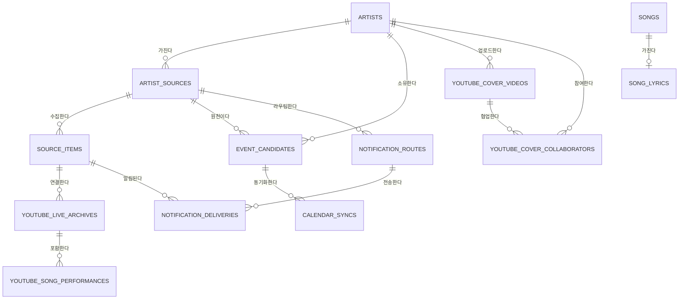

# Schedule Music DB 구조

데이터베이스는 Neon PostgreSQL이며, 애플리케이션은 `DATABASE_URL`을 통해 연결한다.

## ERD

## 테이블별 역할

| 테이블 | 역할 |
| --- | --- |
| `artists` | 아티스트 기본 정보, 소속, Spotify/가사/YouTube 표시 설정 |
| `artist_agencies` | 아티스트 소속 목록 |
| `artist_sources` | X 계정, 공식 사이트, 티켓 사이트, RSS 등 수집 소스 |
| `source_items` | 수집 원문, 외부 ID, 분류 결과. 중복 수집 방지 기준 |
| `event_candidates` | 공연, 티켓, 온라인 이벤트 후보와 일정·장소·가격 정보 |
| `google_oauth_tokens` | Discord 사용자별 Google OAuth 토큰 |
| `calendar_syncs` | Google Calendar 생성 이력 및 중복 생성 방지 |
| `notification_routes` | 서버·소스별 Discord 알림 채널 설정 |
| `notification_deliveries` | 원문 항목별 Discord 전송 이력 및 중복 전송 방지 |
| `youtube_live_archives` | YouTube 라이브 아카이브, 댓글 셋리스트 수집 상태 |
| `youtube_song_performances` | 라이브 안의 곡, 타임스탬프, 원곡 가수, 노래방 번호 |
| `youtube_channel_monitors` | 주기 감시할 YouTube 채널 |
| `youtube_channel_videos` | 감시 채널에서 발견한 영상 |
| `youtube_cover_videos` | 공식 채널의 커버 영상 |
| `youtube_cover_collaborators` | 커버 영상과 함께한 아티스트의 다대다 연결 |
| `karaoke_source_matches` | TJ 등 노래방 번호 조회 결과 캐시 |
| `songs` | YouTube·Spotify 연결 곡의 메타데이터 |
| `song_lyrics` | 곡별 원문 가사, 한국어 번역, 한글 발음, 검수 상태 |
| `spotify_track_title_translations` | Spotify 트랙 제목의 한국어 번역 캐시 |
| `namuwiki_templates` | 나무위키 등록용 템플릿 |

## 핵심 중복 방지 규칙

- `source_items`: `(discord_user_id, source_id, external_id)`가 유일하다.
- `notification_deliveries`: `(notification_route_id, source_item_id)`가 유일하다.
- `calendar_syncs`: 사용자·이벤트·공급자·이벤트 유형 조합이 유일하다.
- `songs`: `(discord_user_id, youtube_video_id)`가 유일하다.

이 규칙들로 같은 게시물의 재수집, 같은 Discord 채널의 재알림, 같은 캘린더 일정의 중복 생성을 막는다.

## 스키마 관리 방식

현재는 Alembic 같은 migration 도구를 사용하지 않는다. `app/core/db.py`의 `CREATE TABLE IF NOT EXISTS`와 `ALTER TABLE ... ADD COLUMN IF NOT EXISTS`가 배포 DB에 점진적으로 스키마를 적용한다. 기존 Railway/Neon 데이터베이스와의 호환성을 우선한 과도기 방식이다.
