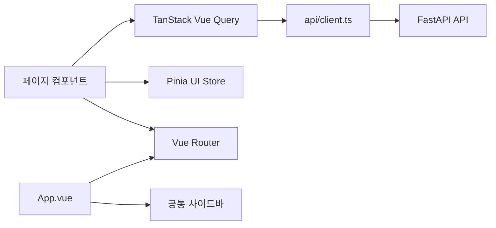

# Schedule Music 프론트엔드 구조

프론트엔드는 `web/` 디렉터리에 있는 Vue 3 + TypeScript + Vite SPA다.

## 구성



- **Vue Router**: URL과 페이지 컴포넌트를 연결한다. 페이지는 lazy import로 불러온다.
- **TanStack Vue Query**: API 조회 캐시, 재조회, 생성·수정·삭제 mutation을 담당한다.
- **Pinia**: 모바일 메뉴, 데스크톱 사이드바 접힘 등 화면 상태를 담당한다.
- **Nuxt UI**: 버튼, 입력창, 모달, 슬라이드오버 등의 공통 UI를 제공한다.
- **`api/client.ts`**: 모든 HTTP 요청의 공통 진입점이다. 페이지가 외부 API를 직접 호출하지 않는다.

## 페이지와 라우팅

| URL | 페이지 | 기능 |
| --- | --- | --- |
| `/` | 대시보드 | 등록 아티스트·일정·운영 상태 요약 |
| `/artists` | 아티스트/소스 관리 | 아티스트·소속·공식 수집 소스 관리 |
| `/profiles` | VSinger 소개 | 프로필 목록 |
| `/profiles/:artistId` | 아티스트 프로필 | 개별 소개와 관련 정보 |
| `/profiles/:artistId/lives/:eventId` | 라이브 상세 | 특정 라이브 정보 |
| `/events` | 라이브 일정 | 공연·티켓 후보 조회와 수동 등록 |
| `/music` | Spotify 음악 | Spotify 아티스트 매칭·디스코그래피 |
| `/music/artists/:artistId` | 아티스트 디스코그래피 | 특정 아티스트 음반 목록 |
| `/lyrics` | 가사 등록 | YouTube 기반 가사·번역·발음 생성 |
| `/lyrics/songs/:songId` | 가사 상세 | 저장된 가사와 번역 확인 |
| `/youtube-lives` | 우타와꾸 기록 | 라이브 아카이브·셋리스트·통계 |
| `/youtube-lives/artists/:artistId` | 아티스트별 우타와꾸 | 선택 아티스트의 라이브 기록 |
| `/youtube-covers` | YouTube 커버곡 | 커버 영상 목록과 협업 필터 |
| `/youtube-covers/artists/:artistId` | 아티스트별 커버 | 선택 아티스트의 커버 영상 |
| `/settings` | 연동 설정 | API 상태와 Google Calendar 연결 |
| 그 외 경로 | 리다이렉트 | `/`로 이동 |

## API 연결

개발 환경에서는 Vite가 `/api-proxy` 요청을 `http://127.0.0.1:8000`으로 프록시한다. 운영 환경에서는 `VITE_API_BASE_URL` 환경 변수로 FastAPI 주소를 지정한다.

```text
Vue 페이지 → api/client.ts → /api-proxy 또는 VITE_API_BASE_URL → FastAPI
```
