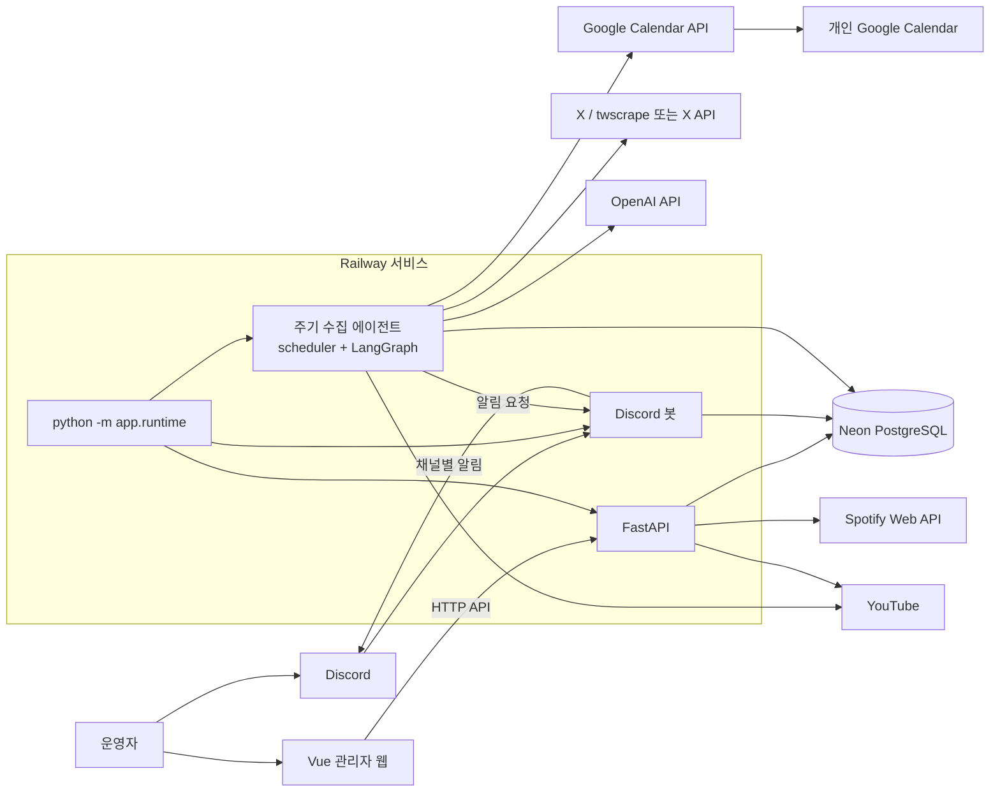
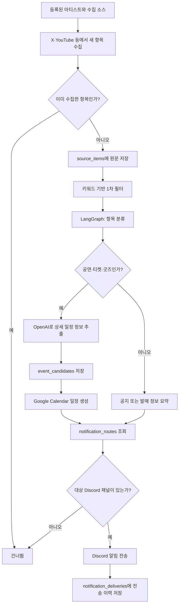

# Schedule Music 시스템 아키텍처

이 문서는 현재 저장소의 코드와 Railway 배포 설정을 기준으로 정리한 시스템 구조 문서다.

## 전체 구성



## 배포와 실행

- **Railway**: 백엔드 배포 환경이다. `railway.json`의 시작 명령은 `python -m app.runtime`이다.
- **Neon**: `DATABASE_URL`로 연결하는 PostgreSQL 데이터베이스다.
- **백엔드 프로세스**: FastAPI 서버, Discord 봇, 그리고 활성화된 경우 주기 수집 에이전트를 `asyncio.gather()`로 동시에 실행한다.
- **프론트엔드**: `web/`의 Vue/Vite 프로젝트다. 개발 중에는 Vite의 `/api-proxy`가 로컬 FastAPI(`127.0.0.1:8000`)로 요청을 넘긴다. 운영 주소는 `VITE_API_BASE_URL`로 설정할 수 있다.

## 수집과 알림 흐름



티켓과 굿즈는 안내·관심 표시·페이지 열기까지만 자동화한다. 구매, 결제, 응모 제출, CAPTCHA 우회는 구현 범위에 포함하지 않는다.

## 사용 기술과 라이브러리

| 구분 | 사용 기술 |
| --- | --- |
| Python 런타임 | Python 3.12.8 |
| API 서버 | FastAPI, Uvicorn, Pydantic, pydantic-settings |
| DB 접근 | PostgreSQL, psycopg 3, SQLAlchemy 2 |
| Discord | discord.py |
| 에이전트 분기 | LangGraph |
| AI | OpenAI SDK, 기본 모델 `gpt-4.1-mini`, Whisper `whisper-1` |
| HTTP 통신 | httpx |
| X 수집 | X API 또는 twscrape |
| YouTube 처리 | yt-dlp, youtube-transcript-api |
| 백엔드 테스트 | pytest |
| 프론트엔드 | Vue 3, TypeScript, Vite, Vue Router |
| 프론트 상태·서버 캐시 | Pinia, TanStack Vue Query |
| UI·프론트 테스트 | Nuxt UI, Vitest, Playwright |

## 외부 API와 용도

| 서비스 | 용도 |
| --- | --- |
| X API / twscrape | 아티스트 공식 X 계정의 새 게시물 수집 |
| OpenAI API | 게시물 유형 분류, 공연·티켓 정보 추출, 번역, 음성 인식 |
| Google OAuth / Calendar API | Discord 사용자별 Google Calendar 연결 및 일정 생성 |
| Spotify Web API | 아티스트 매칭, 앨범·트랙·디스코그래피 조회 |
| YouTube | 영상·채널 정보, 라이브 아카이브, 자막, 셋리스트 수집 |
| Discord API | Slash Command 처리와 설정 채널 알림 전송 |

## 백엔드 패키지 구조와 역할

```text
app/
├─ api/             FastAPI 라우터, 의존성 주입, HTTP 요청·응답 경계
├─ services/        유스케이스 조합과 업무 흐름
├─ repositories/    DB 조회·저장만 담당
├─ db/              SQLAlchemy 모델과 세션
├─ schemas/         API 요청·응답 스키마
├─ core/            환경 설정, 보안, 공통 모델, 기존 DB 초기화
├─ integrations/    X·OpenAI·Spotify·Google·YouTube 외부 연동
├─ agents/          스케줄러와 LangGraph 워크플로
├─ bots/            Discord 봇 lifecycle과 Slash Command
└─ lyrics_pipeline/ 가사 추출·번역·발음 생성 파이프라인
```

새로 정리한 HTTP 기능은 다음 계층 패턴을 따른다.

```text
Router → Service → Repository → SQLAlchemy ORM → PostgreSQL
                         └→ 외부 Integration
```

다만 수집 에이전트와 일부 기존 기능은 `psycopg`의 직접 SQL 및 `app/core/db.py` helper도 사용한다. 따라서 현재는 계층형 구조로 점진적으로 이전 중인 하이브리드 구조다.

## API 경로 원칙

- 정식 HTTP 경로는 `/api/*`다.
- 기존 웹 클라이언트와 Discord 링크 호환을 위해 일부 비접두 경로도 병행한다.
- `/health`, Google OAuth 시작·콜백, 아티스트/소스/일정, Spotify, YouTube, 가사 API가 제공된다.
- 새로 정리된 아티스트·곡·YouTube API는 `API_KEY`가 설정된 경우 `X-API-Key` 인증을 요구한다.
